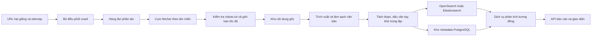

# Kiến trúc nền tảng Minh Chứng

## Trạng thái hiện tại

Phiên bản hiện tại là nền móng chạy thật trên một máy:

- Máy chủ HTTP Python phục vụ giao diện và API.
- SQLite lưu nguồn, lịch sử báo cáo và hàng đợi crawler.
- Nội dung nguồn được lưu theo phiên bản bất biến khi thay đổi.
- SQLite FTS5 lập chỉ mục toàn văn theo từng đoạn.
- Bộ phân tích tìm ứng viên, chấm mức tương đồng và tô màu đoạn cần rà soát.
- Crawler web nhận URL hạt giống, đọc `robots.txt`, giới hạn tốc độ theo tên miền,
  giới hạn dung lượng trang, chỉ đi tiếp trong cùng tên miền theo mặc định và
  chặn truy cập mạng nội bộ. Lỗi tạm thời được retry với backoff và giới hạn số
  lần thử.
- Đọc `.txt`, `.md`, `.docx`, `.pdf`.
- PDF scan ít chữ có OCR fallback tùy chọn qua Tesseract và endpoint kiểm tra trạng thái.
- Quét ký tự vô hình, bảng chữ cái trộn lẫn và định dạng DOCX đáng ngờ.
- Kho bài nộp nội bộ chỉ lập chỉ mục khi người dùng đồng ý và cho phép rút bài
  khỏi kho đối chiếu.
- Không gian dữ liệu theo tổ chức, ba vai trò demo và nhật ký kiểm toán cho thao tác quan trọng.
- Xuất PDF báo cáo từ dữ liệu đã lưu trong phạm vi tổ chức.

SQLite phù hợp cho phát triển, trình diễn và thử nghiệm với một đơn vị nhỏ. Nó
không phải đích cuối cho hàng triệu trang.

Lớp tìm kiếm đã được tách khỏi bộ phân tích. Chế độ mặc định là SQLite FTS5;
adapter OpenSearch có mapping, bulk index, delete-by-query, search và thao tác
reindex từ nguồn hiện có. Việc triển khai cụm OpenSearch thật vẫn cần hạ tầng,
backup, shard sizing và kiểm thử tải.

## Nguyên tắc thu thập dữ liệu

`robots.txt` là điều kiện cần nhưng không thay thế giấy phép sử dụng dữ liệu.
Trước khi thu thập quy mô lớn cần xác định rõ quyền lập chỉ mục, điều khoản dịch
vụ, bản quyền, quyền riêng tư và quy trình gỡ dữ liệu.

Crawler không nên:

- Vượt đăng nhập, paywall hoặc CAPTCHA.
- Thu thập dữ liệu cá nhân không cần thiết.
- Gửi tải lớn đến một tên miền.
- Bỏ qua yêu cầu gỡ dữ liệu hoặc chính sách lưu trữ.

Nên bắt đầu bằng nguồn mở, website của đối tác đã đồng ý và kho bài nộp nội bộ
có sự chấp thuận rõ ràng.

## Kiến trúc cho hàng triệu trang

### Thay thế từng thành phần

| Bản đơn máy | Khi mở rộng |
| --- | --- |
| SQLite `crawl_queue` | Redis Streams, RabbitMQ hoặc Kafka |
| Một tiến trình crawler | Nhiều worker, giới hạn tốc độ theo tên miền dùng chung |
| SQLite FTS5 | Adapter OpenSearch đã có; triển khai cụm theo shard khi mở rộng |
| Nội dung trong SQLite | S3 hoặc kho đối tượng tương thích S3 |
| Metadata SQLite | PostgreSQL |
| Log console | Metrics, tracing, cảnh báo lỗi và dashboard vận hành |

## Pipeline lập chỉ mục nên bổ sung

1. Chuẩn hóa URL, canonical URL và phiên bản nội dung. Phiên bản nội dung cơ bản
   đã có; cần bổ sung chính sách lưu trữ dài hạn trên kho đối tượng.
2. Khử trang trùng bằng `SHA-256`; nhận diện gần trùng bằng `SimHash` hoặc
   `MinHash`.
3. Tách nội dung chính khỏi menu, quảng cáo và chân trang.
4. Tách đoạn có ngữ cảnh chồng lấn để tìm được nội dung ghép từ nhiều nguồn.
5. Lưu ngày thu thập, nguồn, giấy phép, ngôn ngữ và trạng thái gỡ dữ liệu.
6. Lập chỉ mục chính xác và gần đúng; đánh giá chất lượng trên bộ dữ liệu tiếng
   Việt có nhãn.

## Các lớp sản phẩm còn cần tiếp tục xây

- Đăng nhập thật, SSO và quản lý vòng đời tài khoản thay cho header demo.
- Chính sách thời hạn lưu trữ và quy trình xóa dữ liệu theo tổ chức.
- OCR cho ảnh độc lập, hàng đợi OCR và đóng gói Tesseract trong môi trường triển khai.
- Tách bảng biểu, chú thích, danh mục tài liệu tham khảo tốt hơn.
- Mẫu PDF có thương hiệu, chữ ký số và cấu hình theo tổ chức.
- LMS qua LTI 1.3 và API cho trường học.
- So khớp xuyên ngôn ngữ.
- Dòng thời gian viết bài khi người học đồng ý.
- Dashboard vận hành crawler và quy trình gỡ dữ liệu.
- Kiểm thử tải, sao lưu, phục hồi và giám sát bảo mật.

## Mốc triển khai hợp lý

1. Chạy thử nội bộ với nguồn được cấp phép và đo độ chính xác.
2. Đạt `100.000` trang sạch trước khi tăng số lượng worker.
3. Chuyển hàng đợi, metadata và chỉ mục sang hạ tầng phân tán.
4. Mở rộng theo nhóm tên miền, theo dõi chất lượng nguồn và chi phí lưu trữ.
5. Chỉ tuyên bố quy mô hàng triệu trang khi dashboard vận hành chứng minh số
   trang đã lập chỉ mục, ngày cập nhật và tỷ lệ lỗi.
